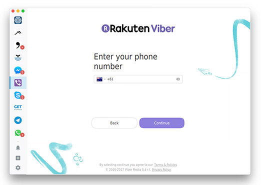

# Franz Viber Plugin

This is a plugin for the Franz messenger app that wraps Viber inside a docker container, published via novnc.

_(In simple terms think of this as a "web based" Viber...)_

-------------------



### Steps to get started:

To get up and running you will need to:

 1. Install [Docker](https://www.docker.com/) (on your machine, or a server somewhere that will "publish" your Viber application)...
 2. Install [Docker Compose](https://docs.docker.com/compose/install/) - Pretty straightforward, follow the instructions...
 3. Configure & start the Viber container...
 4. Install the Viber plugin to Franz.

### Configuring & Starting Viber Container

This is fairly straightforward, just run the following commands from the `viber-docker` directory:

```
docker-compose up --build -d
```

By default the container will auto-start when Docker starts (so if you restart your computer, it will come back automatically).

### Install plugin to Franz

Please see the [franz-plugin/readme](franz-plugin/readme.md) file for instructions on installing and enabling the Viber Plugin within Franz.

### Moving Files/Directories?

If you move this project's files around after you have stood up the docker container, you will need to: `docker-compose down && docker-compose up -d` the _viber-docker_ directory again.

### Future Improvements
- There's currently no notifications hooked into Franz - We might be able to do this by monitor any signal sent via libpulse and assume it's a Notification? 

- Map audio through to Host Client from Libpulse (See: https://github.com/novnc/noVNC/issues/302)